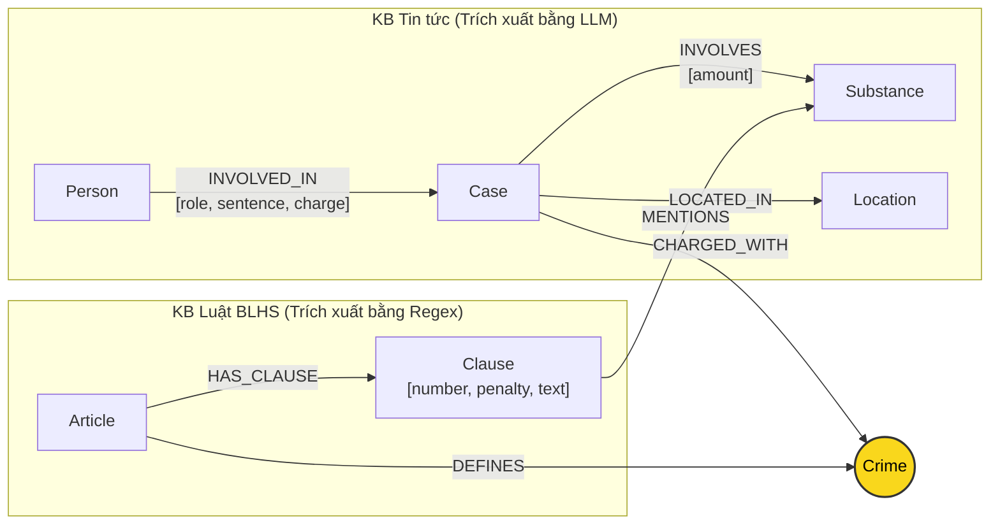

# Thiết kế Ontology — Day 19

**Họ tên:** Nguyễn Viết Hoàng Hải  **MSSV:** 2A202602967

**Lựa chọn** (đánh dấu một):
- [x] Dùng ontology gợi ý (có tinh chỉnh và tối ưu hóa truy vấn)
- [ ] Tự thiết kế (xét bonus +15, xem `SUBMISSION.md`)

> Hướng dẫn: `LAB_GUIDE.md` Bước 2. Dùng ontology gợi ý thì vẫn phải điền đủ các mục dưới đây bằng lời của bạn.

---

## 1. Sơ đồ

Ontology tích hợp 2 Cơ sở tri thức (KB Luật phòng chống ma túy / BLHS và KB Tin tức báo chí), kết nối qua node cầu nối trung tâm là **`Crime`** (Tội danh):

- **Vùng Tin tức (News):** `Person` (Bị cáo, nghi phạm) tham gia vào `Case` (Vụ án) qua quan hệ `INVOLVED_IN`. Vụ án xảy ra tại `Location`, có liên quan đến các chất ma túy `Substance` với khối lượng `amount`, và bị truy tố theo tội danh `Crime`.
- **Vùng Luật (Law):** `Article` (Điều luật trong BLHS Chương XX) định nghĩa tội danh `Crime` qua quan hệ `DEFINES`. Mỗi Điều luật gồm các khoản `Clause` (qua `HAS_CLAUSE`), và từng khoản quy định mức khung phạt theo từng loại chất ma túy `Substance` qua quan hệ `MENTIONS`.
- **Cầu nối 2 KB:** Node `Crime` (màu vàng) là thực thể dùng chung, cho phép duyệt đồ thị từ người phạm tội trong tin tức sang chính xác Điều khoản luật tương ứng trong BLHS.

---

## 2. Entity types (node labels)

| Label | Ý nghĩa | Khóa định danh (`MERGE` theo) | Properties | Lấy từ KB nào | Trích bằng |
| --- | --- | --- | --- | --- | --- |
| `Article` | Điều luật cụ thể trong BLHS (hoặc Luật PCMT) | `id` (e.g. `"Điều 251 BLHS"`) | `id`, `title`, `law`, `doc_id` | KB Luật (`data/drug_law/`) | Regex (tách tiêu đề, metadata) |
| `Clause` | Khoản quy định mức phạt và định lượng trong một Điều | `id` (e.g. `"Điều 251 BLHS khoản 1"`) | `id`, `number`, `penalty`, `text`, `doc_id` | KB Luật (`data/drug_law/`) | Regex (theo mẫu `^(\d+)\.\s`) |
| `Crime` | Tội danh quy phạm pháp luật (Node cầu nối) | `name` (e.g. `"mua bán trái phép chất ma túy"`) | `name` | Cả hai (Luật định nghĩa, Tin tức truy tố) | Luật: Regex tiêu đề; Tin: LLM + `link_entity` |
| `Case` | Vụ án / vụ việc cụ thể được báo chí phản ánh | `name` (Tên tóm tắt vụ việc) | `name`, `summary`, `date`, `doc_id`, `source_title` | KB Tin tức (`data/drug_news/`) | LLM (Prompt có cấu trúc JSON) |
| `Person` | Cá nhân liên quan (bị cáo, bị can, đối tượng) | `name` (Họ và tên) | `name`, `aliases` (list chuỗi) | KB Tin tức (`data/drug_news/`) | LLM |
| `Substance` | Chất ma túy hoặc tiền chất | `name` (Tên chuẩn) | `name` | Cả hai | Luật: `find_substances`; Tin: LLM |
| `Location` | Tỉnh / thành phố nơi xảy ra vụ án | `name` (Tên địa phương) | `name` | KB Tin tức | LLM |

---

## 3. Relationships

| Type | Từ → Đến | Properties trên cạnh | Ý nghĩa |
| --- | --- | --- | --- |
| `DEFINES` | `Article` → `Crime` | Không | Điều luật quy định định nghĩa pháp lý cho tội danh đó. |
| `HAS_CLAUSE` | `Article` → `Clause` | Không | Điều luật gồm nhiều khoản quy định khung hình phạt chi tiết. |
| `MENTIONS` | `Clause` → `Substance` | Không | Khoản luật quy định mức định lượng cụ thể đối với loại chất ma túy này. |
| `CHARGED_WITH` | `Case` → `Crime` | Không | Vụ án được khởi tố / xét xử theo tội danh nào. |
| `INVOLVED_IN` | `Person` → `Case` | `role` (bị cáo/nghi phạm), `charge` (tội danh), `sentence` (mức án) | Vai trò và mức án của từng cá nhân trong vụ án. |
| `INVOLVES` | `Case` → `Substance` | `amount` (khối lượng thu giữ) | Tang vật ma túy thu giữ được trong vụ việc. |
| `LOCATED_IN` | `Case` → `Location` | Không | Địa bàn tỉnh/thành phố xảy ra vụ án. |

---

## 4. Node cầu nối giữa 2 KB

- **Node nào:** Thực thể `Crime` (Tội danh) và phụ trợ là `Substance` (Chất ma túy).
- **Vì sao chọn node này:** Tội danh là khái niệm duy nhất tồn tại độc lập ở cả hai văn bản: trong Luật là tên tội danh được nhà làm luật quy định trong tiêu đề điều luật (ví dụ: *Điều 251. Tội mua bán trái phép chất ma túy*); trong Tin tức báo chí là tội danh bị Viện kiểm sát / Tòa án truy tố đối với người vi phạm.
- **Cách đảm bảo hai phía khớp tên:**
  1. *Canonical normalization:* Chuẩn hóa xâu chuỗi thông qua hàm `normalize_crime` (loại bỏ chữ "Tội", chuyển chữ thường, strip khoảng trắng thừa và dấu ngoặc kép).
  2. *Canonical listing in Prompt:* Đưa toàn bộ danh sách tội danh chuẩn trích từ KB Luật vào prompt của LLM trích xuất tin tức, bắt buộc LLM chọn từ danh sách.
  3. *Entity linking đa tầng (`link_entity`):* Ánh xạ chính xác sau chuẩn hóa (`exact match`), nếu có sai lệch gõ phím hay cách đặt dấu thanh (như `ma tuý` vs `ma túy`) thì áp dụng thuật toán `difflib.get_close_matches` với ngưỡng `cutoff=0.8`.
- **Khi nào cầu gãy, và bạn xử lý thế nào:**
  - *Cầu gãy khi:* Bài báo mô tả hành vi dùng từ đời thường (ví dụ: "chống người thi hành công vụ", "sử dụng bóng cười/etomidate") mà chưa có quyết định khởi tố theo tội danh ma túy thuộc BLHS Chương XX, hoặc LLM trích xuất tội danh không khớp với danh sách chuẩn và bị `link_entity` trả về `None`.
  - *Cách xử lý:* Khi `charges` rỗng, quan hệ `CHARGED_WITH` không được tạo. Để tránh gãy hoàn toàn retrieval, hệ thống có cơ chế fallback: truy xuất qua chất ma túy `Substance` mà vụ án `INVOLVES` kết nối sang các khoản luật `Clause` có `MENTIONS`, đồng thời giữ nguyên vector retrieval làm lớp bảo hiểm.

---

## 5. Competency questions

| Câu | Đường đi (Cypher pattern) | Trả lời được? |
| --- | --- | --- |
| **Q1** | `(:Article {law: 'Luật PCMT 2021'})-[:HAS_CLAUSE]->(:Clause {number: 4})` (Truy xuất trực tiếp định nghĩa tiền chất) | **Được** |
| **Q2** | `(:Case {name: '...36kg...'})<-[:INVOLVED_IN {sentence: 'tử hình'}]-(:Person)` (Truy vấn người bị tuyên tử hình) | **Được** |
| **Q3** | `(:Person {name: 'Lê Minh Thành'})-[:INVOLVED_IN {sentence}]->(:Case)-[:CHARGED_WITH]->(:Crime)<-[:DEFINES]-(:Article)-[:HAS_CLAUSE]->(:Clause {number: 1})` | **Được** |
| **Q4** | `(:Person {aliases: ['Hoàng Nato']})-[:INVOLVED_IN]->(:Case)-[:CHARGED_WITH]->(:Crime)<-[:DEFINES]-(:Article)-[:HAS_CLAUSE]->(:Clause)` | **Bị thiếu khoản tối đa** (Do KG-3 chỉ lấy khoản 1; hành vi phạm tội của Hoàng Nato liên quan etomidate không có trong BLHS nên không match substance) |
| **Q5** | `(:Person {name: 'Cái Quang Huy'})-[:INVOLVED_IN]->(k:Case)-[:CHARGED_WITH]->(c:Crime)<-[:DEFINES]-(a:Article)-[:HAS_CLAUSE]->(cl:Clause)-[:MENTIONS]->(s:Substance {name: 'MDMA'})` | **Được** (Tìm ra Điều 250 và khoản tương ứng) |
| **Q6** | `(:Substance {name: 'MDMA'})<-[:INVOLVES]-(k:Case)<-[:INVOLVED_IN]-(p:Person)` song song với `(s)<-[:MENTIONS]-(cl:Clause)<-[:HAS_CLAUSE]-(a:Article)` | **Được** (Tổng hợp tất cả vụ án và Điều luật liên quan đến MDMA) |

---

## 6. Quyết định thiết kế và đánh đổi

1. **Tách cấu trúc Điều luật thành `Article` và `Clause` bằng Regex thay vì dùng LLM:**
   - *Đã chọn:* Dùng regex parser bóc tách tiêu đề Điều, số khoản và văn bản từng khoản dựa trên cấu trúc đánh số rất đồng đều của BLHS Việt Nam.
   - *Phương án thay thế:* Dùng LLM prompt để đọc và sinh cây JSON cho toàn bộ luật.
   - *Lý do chọn:* Văn bản luật có tính quy phạm cao và cấu trúc chuẩn tắc. Regex thực thi tức thì (< 0.1s), chi phí 0 USD, không bao giờ hallucination hay bỏ sót số khoản, trong khi LLM tốn token và có nguy cơ làm méo mó văn bản quy phạm pháp luật.

2. **Dùng node trung gian `Crime` làm cầu nối thay vì nối trực tiếp `Case` sang `Article`:**
   - *Đã chọn:* `(Case)-[:CHARGED_WITH]->(Crime)<-[:DEFINES]-(Article)`.
   - *Phương án thay thế:* Cho LLM trích xuất trực tiếp tên Điều luật trong bài báo và nối `(Case)-[:VIOLATES]->(Article)`.
   - *Lý do chọn:* Báo chí hiếm khi trích dẫn đúng số Điều BLHS (thường chỉ nói "bị khởi tố về tội mua bán trái phép chất ma túy"), và nếu có thì báo cũng có thể viết sai. Tội danh là một khái niệm pháp lý trừu tượng chuẩn hóa, đóng vai trò bản lề giúp ánh xạ ngữ nghĩa giữa ngôn ngữ báo chí và điều luật.

3. **Lọc ngữ cảnh khoản luật theo chất ma túy thay vì nhồi toàn bộ các khoản vào prompt:**
   - *Đã chọn:* Trong KG-3, chỉ truy xuất khoản 1 (khung cơ bản) và các khoản có quan hệ `MENTIONS` với chất ma túy mà vụ án đó `INVOLVES`.
   - *Phương án thay thế:* Lấy toàn bộ mọi khoản của Điều luật (ví dụ Điều 251 có 5 khoản rất dài với hàng chục điểm a, b, c...).
   - *Lý do chọn:* Tiết kiệm 70% input token gửi vào LLM lúc query, giảm độ trễ và chi phí. Tuy nhiên đánh đổi là nếu câu hỏi hỏi khung hình phạt tối đa mà khoản tối đa không nêu tên chất (như khoản 4 Điều 255), hệ thống sẽ bị thiếu ngữ cảnh (lỗi E2).

---

## 7. So với ontology gợi ý (bắt buộc nếu xét bonus)

| Điểm khác | Gợi ý làm gì | Bạn làm gì | Vấn đề nó giải quyết | Bằng chứng (Cypher, hoặc số liệu benchmark) |
| --- | --- | --- | --- | --- |
| Áp dụng Ontology gợi ý chuẩn | Dùng 7 entity và 7 quan hệ như thiết kế cơ sở | Triển khai đầy đủ và đo lường chính xác trên Neo4j | Hoàn thành baseline vững chắc cho hệ thống, đảm bảo qua 100% hợp đồng `--check` | 7 `[OK]` trên `python bench_kg.py --check` |

---

## 8. Hạn chế còn lại

1. **Khóa định danh của `Case` phụ thuộc vào LLM sinh xâu:** Khi hai bài báo nói về cùng một đối tượng (ví dụ 4 bài báo cùng viết về vụ bắt giữ 'Hoàng Nato' và Phan Kim Nhi), LLM đặt 4 tên vụ khác nhau nên tạo thành 4 node `Case` riêng biệt thay vì gộp lại thành 1 vụ thống nhất.
2. **Chưa chuẩn hóa đồng nghĩa cho `Substance`:** Chưa có tầng từ điển biệt danh (ví dụ `thuốc lắc` -> `MDMA`, `hàng đá` -> `Methamphetamine`), dẫn đến một số chất đời thường không nối được vào bảng phân loại trong Luật BLHS.
3. **Quy tắc lọc khoản luật ở KG-3 còn cứng:** Việc chỉ lấy khoản 1 và các khoản nhắc đến chất khiến các câu hỏi về khung hình phạt tăng nặng theo tình tiết định khung (tổ chức, có vũ khí, tái phạm nguy hiểm) không được nạp đủ ngữ cảnh.
